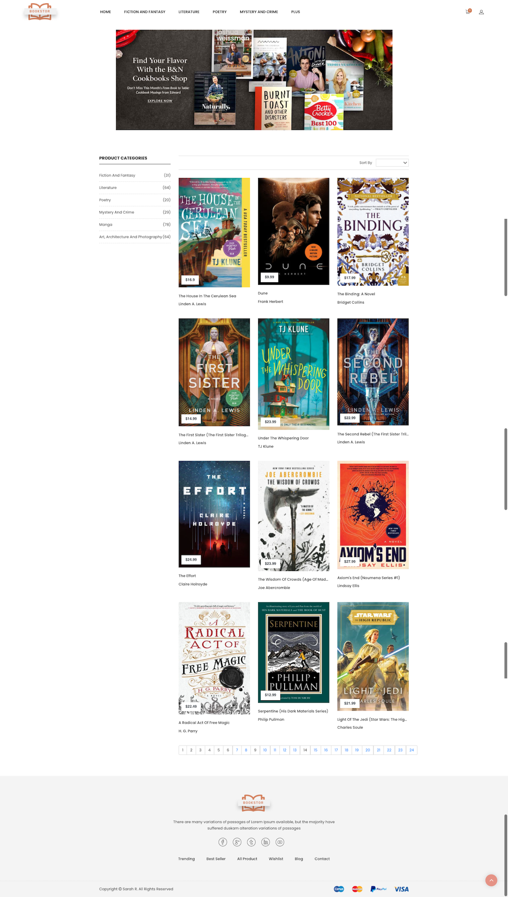
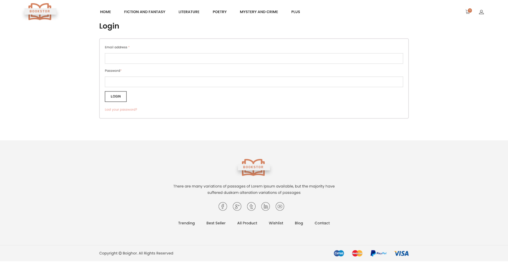
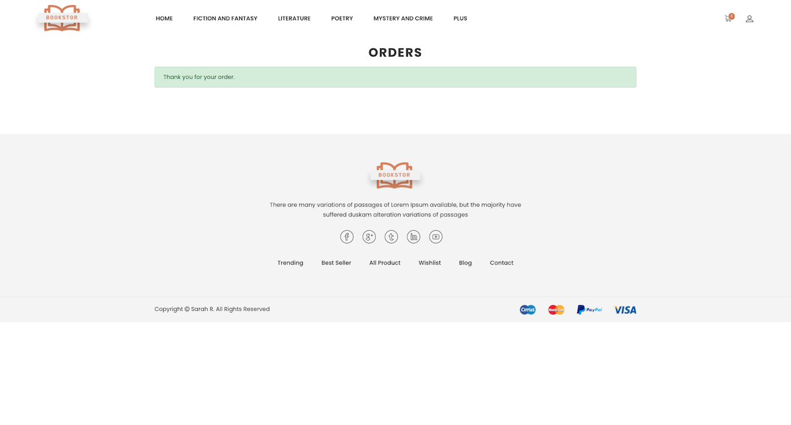

# BookShop

### Mini site e-commerce  : Boutique en ligne de livres
Java EE, JDBC, Tomcat, DAO, SQL, HTML, CSS, JavaScript, Bootstrap, Mamp, Terminal, Eclipse 

### Approfondir les connaissances sur les thèmes suivant :

+ Développement d'une interface utilisateur
+ Développement  des composants d'accès aux données
+ Conception et mise en place d’une base de données
+ POO : héritage, encapsulation, modificateur d'accès 
+ Java EE : servlet, jsp, mvc
+ Front-end : template 
+ Recherche

 

